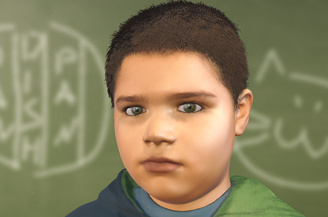

## FastFakeSkin for Unity 3d

FastFakeSkin is a hassle-free skin authoring shader. 

----

**FastFakeSkin** (in particular, the skin matcap part) was originally written as a GLSL shader for Vray. 

FastFakeSkin uses skincaps (skin matcaps) and blends them with the main diffuse texture via a mask. Changing the skincap of a given FFS material allows for a quick and easy alternation of the overall look. 

This shader does not pretend to produce realistic results. However, FFS has the advantage of being extremely easy to use. This makes it pretty decent for prototyping. FFS may also be used scenarios, where you have many characters and need to make many variations of the skin materials. 

----

**FFS comes in three versions:**

**FastFakeSkin** - diffuse + skincap. Based on Unity Standard Shader. Has been tested on android. 

**NotSoFastFakeSkin** - diffuse + normal + skincap. Based on Unity Standard Shader. Produces better results than the first one. May also be used for interesting skin types such as humanoids, androids, robots, etc. 

**NotSoFastNotSoFakeSkin** - diffuse + masks + normal + skincap + brdf. Advanced shader. Masks texture is not required for it to work. Produces decent looking skin. That's what FFS is all about. It works best in linear mode. 

**FFS includes 2 Cutout Mask variants:**

**FFS Cutout** - same as the nicest FFS, but with a single cutout mask in the Diffuse Alpha channel.

**FFS Cutout Multimask** - same as the nicest FFS, but with a 4 cutout masks in a dedicated texture. Masks can be switched, which makes it easy to author customizable characters.

Please check the demo scenes and the Quick Tutorial doc for more information.

----

